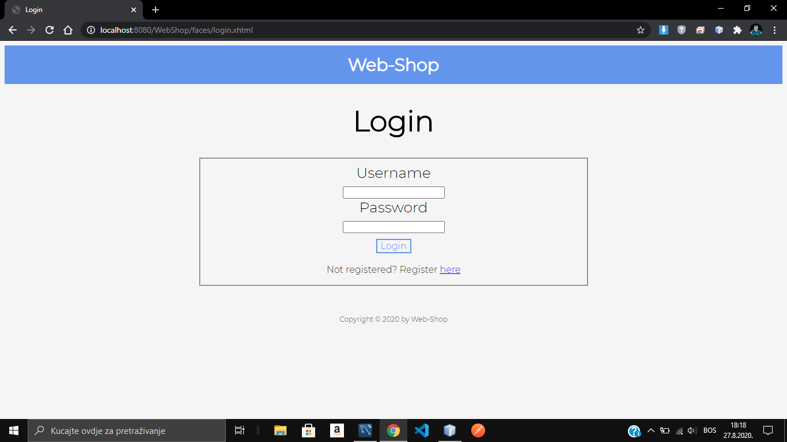
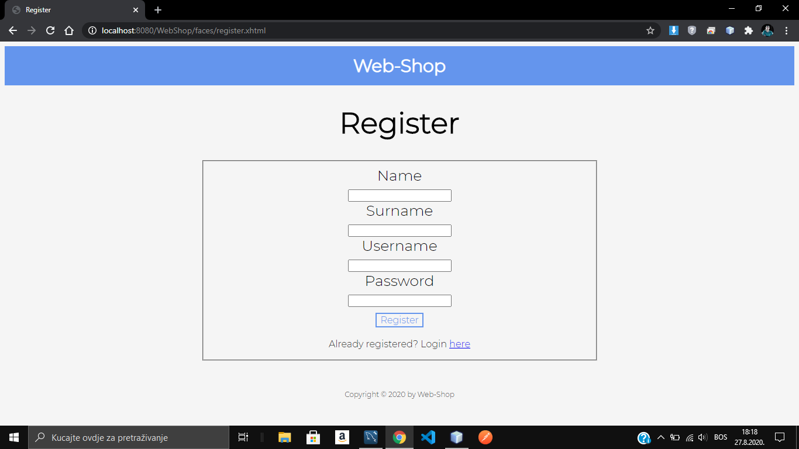
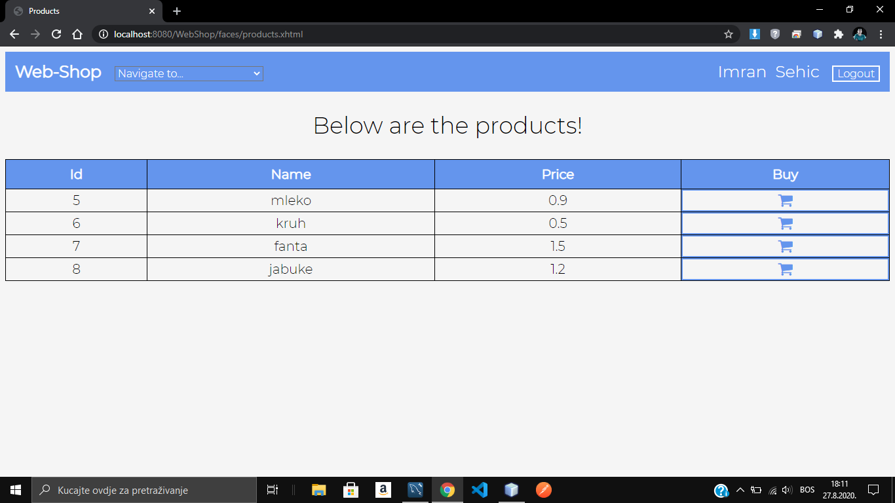
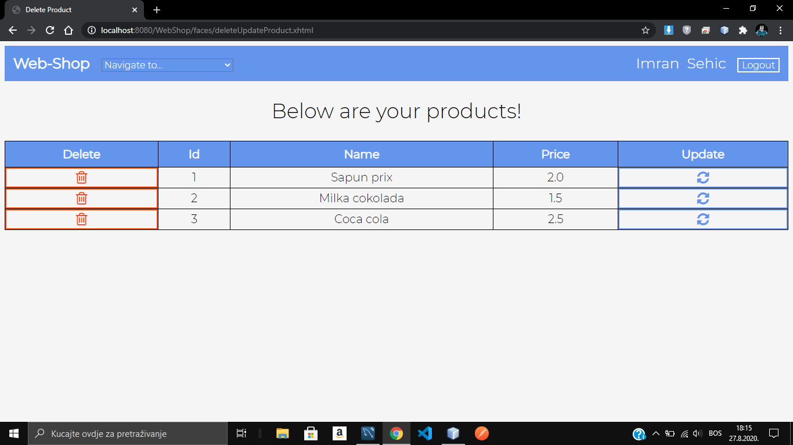
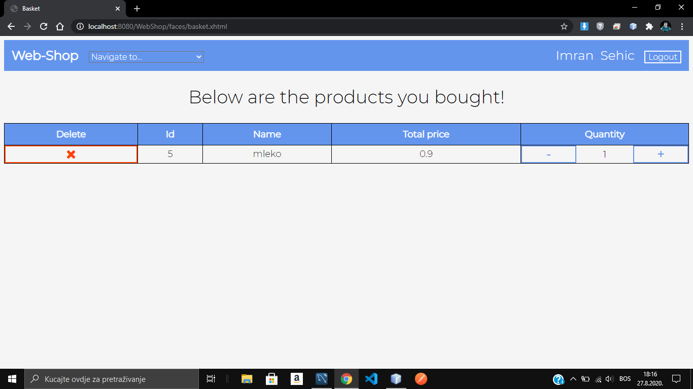
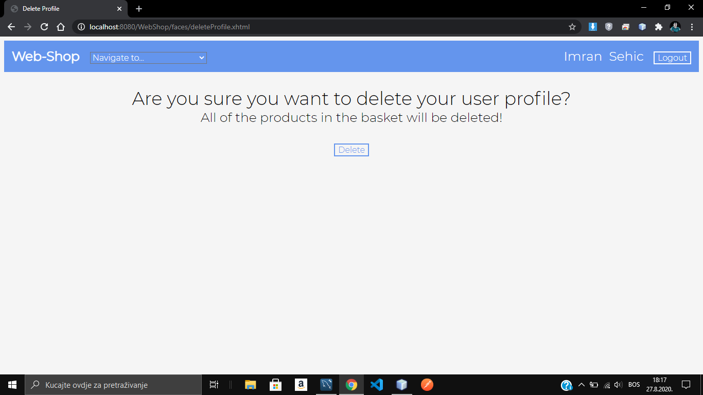

# WebShop
<h3>This is a WebShop application built in JSF-Java Server Faces framework.</h3>  
The application contains a login and a register page. Besides that a user can buy products other users inserted, delete or buy more products of same kind in the basket page, delete it's own products from the web-shop and update or delete it's own user profile.  
The application uses Hibernate and JPA to communicate to the mySQL database where all the data is stored.  
Below are some of the screenshots of the application itself.

## 1.Login

 

## 2.Register

 

## 3.Products

 

## 4.Delete and Update Products

 

## 5.Basket

 

## 6.Delete User Profile

